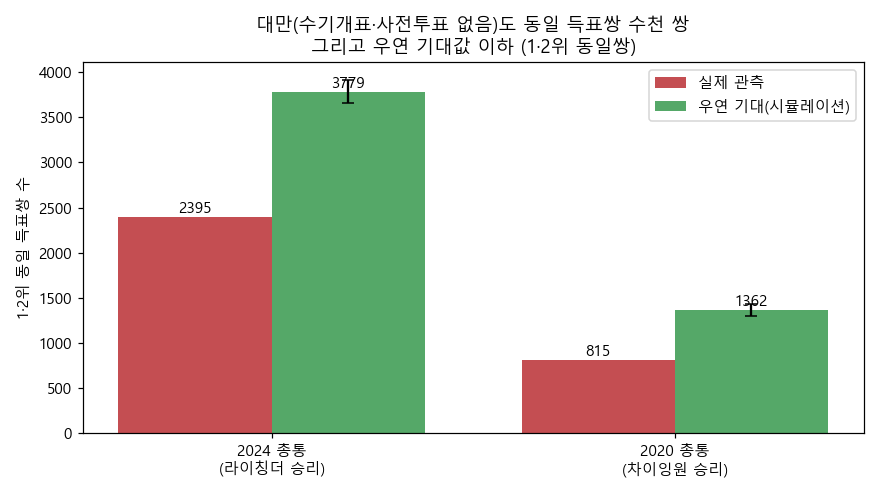

# 대만 사례 — 수기개표·사전투표 없는 "클린 선거"에서도 동일 득표쌍은 수천 쌍

**작성일** 2026년 6월 10일
**대상** 대만 제15·16대 총통선거 (2020 차이잉원 / 2024 라이칭더)
**자료 출처** 대만 중앙선거위원회 선거자료고 [db.cec.gov.tw](https://db.cec.gov.tw/) · 정부자료개방플랫폼 [data.gov.tw](https://data.gov.tw/dataset/13119) (투개표소별 득표, `votedata.zip`)
**관련 보고서** 「2026년 6·3 지방선거 '사전투표 동일 득표쌍' 의혹」(본편)

---

## 1. 왜 대만인가

부정선거를 주장하는 쪽에서 자주 **"대만처럼 사전투표를 없애고 전면 수기(손)개표를 하면 깨끗하다"**고 말합니다. 그렇다면 그 대만 선거에는 "동일 득표쌍"이 없어야 할 것입니다.

실제로 그런지 **대만 중앙선거위원회의 투개표소별 공식 개표결과**로 직접 확인했습니다. 대만 총통선거는 **사전투표가 없고, 전 투표소에서 100% 수기 개표**합니다.

---

## 2. 데이터

| 선거 | 승자(정당) | 투개표소 | 후보 수 | 개표 방식 |
|---|---|---|---|---|
| 2020 제15대 총통 | 차이잉원(민진당) | 17,226 | 3명 | 전면 수기개표·사전투표 없음 |
| 2024 제16대 총통 | 라이칭더(민진당) | 17,795 | 3명 | 전면 수기개표·사전투표 없음 |

각 투개표소(投開票所)의 후보별 득표를 한국 분석과 똑같은 방법으로 전수 집계해 1·2위 동일 득표쌍을 셌습니다.

---

## 3. 결과 — 동일쌍이 "수천 쌍"

| 선거 | 1·2위 동일쌍 (관측) | 우연 기대(시뮬레이션) | 후보 **전원(3명)** 득표 완전일치 |
|---|---|---|---|
| 2024 (라이칭더) | **2,395쌍** | 3,779 (95% 3,655~3,918) · p=1.00 | **5쌍** |
| 2020 (차이잉원) | **815쌍** | 1,362 (95% 1,293~1,435) · p=1.00 | **16쌍** |

- 한국에서 "6쌍"이 부정선거 근거로 제기됐지만, **수기개표·사전투표 없는 대만에는 1·2위 동일쌍이 수천 쌍** 있습니다.
- 심지어 **세 후보 득표가 통째로 똑같은** 투개표소 쌍도 있습니다(2024년 5쌍, 2020년 16쌍). 예: 2024년 두 투개표소가 나란히 **(柯文哲 278, 賴清德 395, 侯友宜 312)** 로 완전 동일.
- 그런데도 관측치는 **우연 기대값보다 적습니다**(p=1.00). 한국·과거 대선과 똑같은 패턴입니다.

> "동일쌍 = 조작"이라면, 부정선거론자들이 본받자던 대만이 한국보다 **수백 배 더 부정선거**가 됩니다. 명백한 모순입니다.

---

## 4. 공정한 비교 — 같은 "투표소(투표구)" 단위로

대만 투개표소(약 1.8만)와 비교하려면 한국도 같은 **투표구(실제 투표소) 단위**로 봐야 합니다. 한국 대선 역시 투표구가 **1.3만~1.4만 개**로 같은 자릿수입니다(앞 보고서 REPORT2의 과거 대선 데이터, 전국 풀링 기준). 같은 단위로 놓고 비교하면:

| 선거 (투표구 단위) | 투표소 수 | 평균 득표/투표소 | 1·2위 동일쌍(전국 풀링) |
|---|---|---|---|
| 한국 18대 (박근혜·2012) | 13,542 | 2,175 | 55 |
| 한국 19대 (문재인·2017) | 13,964 | 1,528 | 289 |
| 한국 20대 (윤석열·2022) | 14,464 | 1,197 | 229 |
| 대만 2020 (차이잉원) | 17,226 | 830 | 815 |
| 대만 2024 (라이칭더) | 17,795 | **784** | **2,395** |

- 대만이 더 많은 이유는 **두 가지가 함께** 작용하기 때문입니다.
  - **① 투표소가 더 많다:** 대만 약 1.7~1.8만 vs 한국 1.3~1.4만 → 서로 비교할 수 있는 쌍이 약 **1.7배**(C(N,2): 약 1.58억 vs 0.92억) 많습니다.
  - **② 투표소당 투표인이 더 적다:** 대만은 1곳당 평균 **784표**로 한국(1,200~2,200표)의 **절반 이하**입니다. 득표수가 작을수록 1·2위가 작은 숫자라 한 쌍이 우연히 겹칠 확률이 훨씬 큽니다 — 이 효과가 더 결정적입니다(생일의 역설).
  - **두 요인이 곱해져** 동일쌍이 수십 배로 늘어납니다(3파전이라 1·2위가 서로 가까운 것도 가세).
- 한국 안에서도 같은 법칙이 보입니다 — 투표소가 더 작은 19·20대(평균 1,200~1,500표)가 18대(2,175표)보다 동일쌍이 몇 배 많습니다.
- 그리고 모든 경우가 **각자의 우연 기대값 이하**입니다.

**결론적으로, 사전투표를 없애고 작은 투표소에서 100% 수기개표하는 대만 방식은 동일쌍을 줄이기는커녕 오히려 늘립니다.** 동일쌍은 개표 방식이 아니라, "작은 숫자를 가진 많은 투표소를 비교하면 같은 쌍이 반드시 나온다"는 산수(생일의 역설)의 문제입니다.

---

## 5. 결론

> **"수기개표·사전투표 폐지 = 동일쌍 없는 깨끗한 선거"는 사실이 아닙니다.**

| 주장 | 검증 결과 |
|---|---|
| 대만식 수기개표면 동일쌍이 없다 | ✘ **거짓** — 1·2위 동일쌍 2024년 2,395쌍, 2020년 815쌍 |
| 동일쌍은 사전투표·전자개표 탓이다 | ✘ **거짓** — 사전투표 없고 100% 수기인 대만이 훨씬 많다 |
| 동일쌍은 비정상이다 | ✘ **거짓** — 대만도 우연 기대값 이하(p=1.00) |

대만의 "깨끗한" 선거에 동일쌍이 수천 쌍 나온다는 사실은, **동일 득표쌍이 개표 방식·국가·진영을 가리지 않는 보편적 통계 현상**임을 보여줍니다. 한국의 "6쌍"은 그 거대한 자연 현상의 지극히 작은 일부일 뿐입니다.

---

### 자료·재현
- 출처: 대만 중앙선거위 `votedata.zip`(투개표소별 득표, 2025-01-24 갱신) → `2024總統立委/總統/elctks.csv` 등
- 코드: `tw_analyze.py` (파싱·관측·시뮬레이션) · `tw_plot.py` (그래프)
- 한계: 시뮬레이션은 縣市 단위 평균 지지율 모형이라 동일쌍을 과대추정합니다(그래서 관측이 더 낮음).
