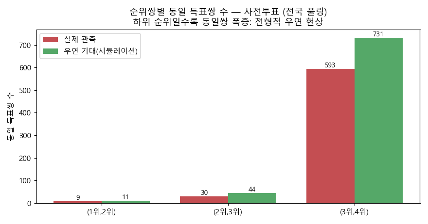
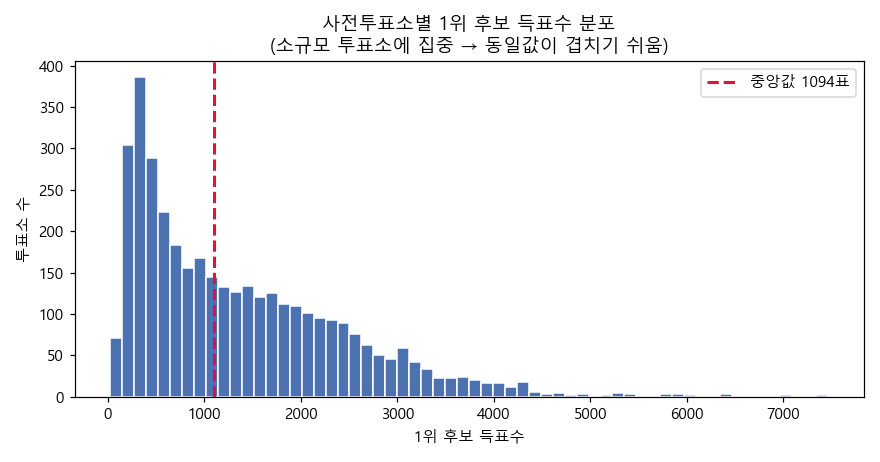
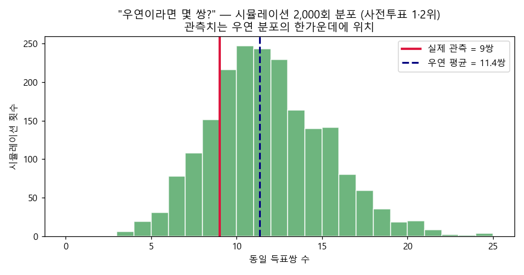
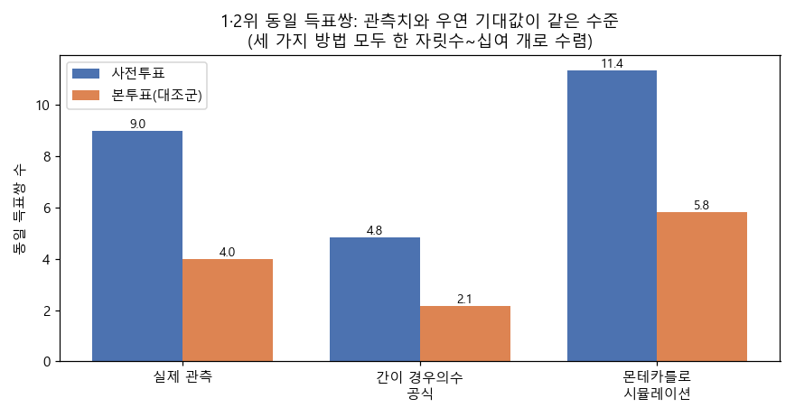
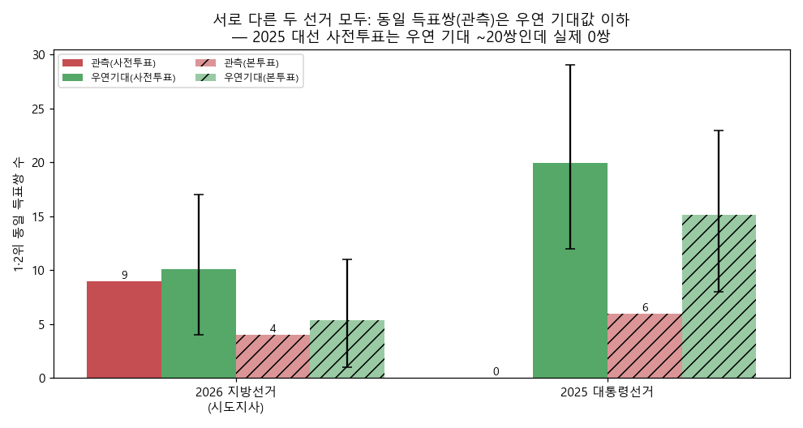
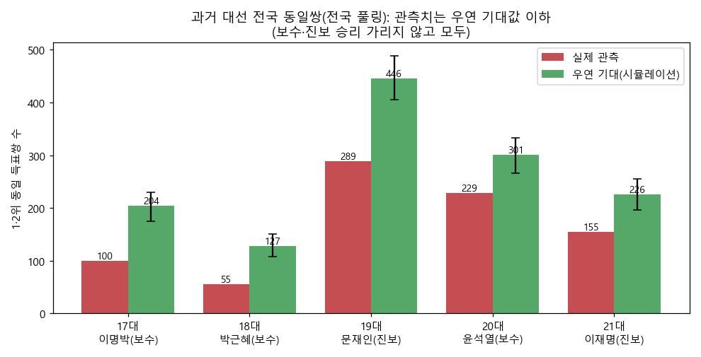
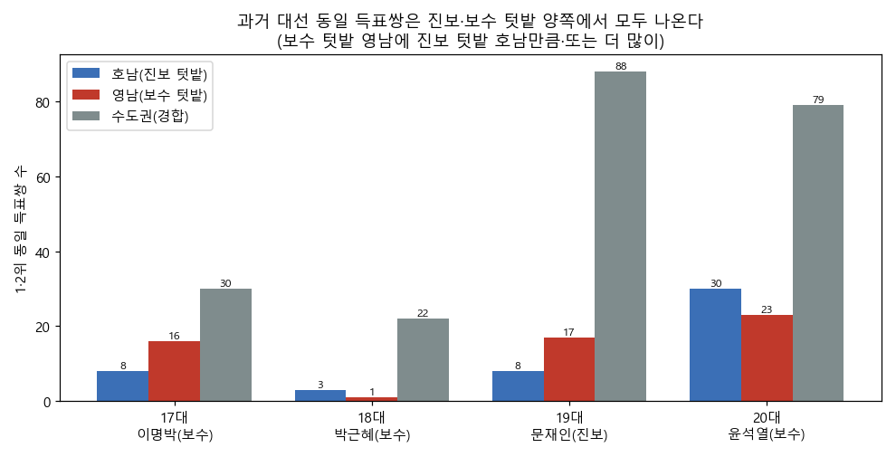
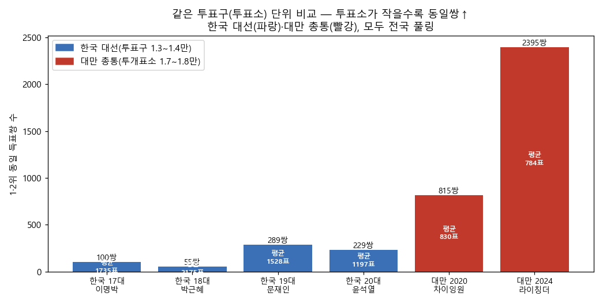

# 2026년 6·3 지방선거 "사전투표 동일 득표쌍" 부정선거 의혹 — 데이터로 끝까지 따져보기

**작성일** 2026년 6월 10일
**자료 출처** 중앙선거관리위원회 선거통계시스템 [info.nec.go.kr](https://info.nec.go.kr/) · 국가선거정보 개방포털 [data.nec.go.kr](http://data.nec.go.kr/) · 대만 중앙선거위원회 [db.cec.gov.tw](https://db.cec.gov.tw/)

---

## 1. 왜 이 조사를 했나

2026년 6월 3일 제9회 전국동시지방선거를 두고 부정선거 의혹이 제기됐습니다.

- **주장:** 사전투표에서 1위 후보 득표수(`a`)와 2위 후보 득표수(`b`)가 **정확히 똑같은** 투표소가 여러 쌍 — 총 **6쌍** — 발견되었다.
- **함의:** 누군가 득표수를 인위적으로 "끼워 맞춘" 흔적이 아니냐는 것.

이 주장이 통계적으로 성립하는지 데이터로 검증했습니다. 그리고 검증 과정에서 나온 여러 **반론까지 하나씩 데이터로 답했습니다.** 보고서는 세 개의 질문에 차례로 답하는 구조입니다.

> - **질문 ①** "6쌍"은 비정상적으로 많은가? → **4장**
> - **질문 ②** 2026년만의, 또는 특정 진영만의 현상인가? → **5장**
> - **질문 ③** 사전투표·전자개표 탓인가? 수기개표하면 깨끗한가? → **6장**

---

## 2. 무엇을, 얼마나 조사했나

의혹을 정밀하게 검증하기 위해, 한국의 여러 선거와 **대만 선거까지** 공식 데이터를 전수 수집했습니다.

| 데이터 | 단위·규모 | 입수 방법 |
|---|---|---|
| **2026 지방선거** (시도지사·국회의원) | 읍면동 단위 **7,489개**(사전 3,731 + 본투표 3,758) | 선관위 크롤링 |
| 2025 제21대 대선 | 읍면동 단위 7,108개 | 선관위 크롤링 |
| 과거 대선 4회 (제17~20대) | 투표구(투표소) **55,148개** | 개방포털 전체파일 |
| 대만 총통선거 2회 (2020·2024) | 투개표소 **35,021개** | 대만 선거DB 전체파일 |

→ 합계 **10만 개가 넘는** 투표소·개표단위를 전수 분석했습니다(표본추출 없음).

- **"사전투표 투표소"의 정의** = 각 읍면동의 **관내사전투표** 득표(읍면동당 1개소).
- **비교용 대조군** = 같은 읍면동의 **선거일투표(본투표)**.
- 2026 사전투표는 선거별 후보 **2~5명**, 총 **755만 표**, 투표소당 평균 **2,026표**(가장 작은 곳 46표 ~ 가장 큰 곳 10,080표)입니다.

> **본투표·다른 선거·대만까지 받은 이유:** "6쌍이 많은가?"는 비교 기준이 있어야 답할 수 있습니다. 의혹을 받지 않는 본투표, 다른 선거, 그리고 "깨끗하다"고 거론되는 대만이 모두 좋은 비교군입니다.

---

## 3. 어떻게 분석했나

각 투표소에서 후보 득표를 큰 순서로 줄 세워 **1·2·3·4위 득표수**를 뽑고, **두 투표소의 득표수가 똑같으면 "동일쌍" 1개**로 셌습니다(3곳이 같으면 3쌍).

"우연이라면 몇 쌍이 나오나?"는 **세 가지 방법**으로 따졌습니다.

- **① 간이 경우의 수 계산** — 손으로 푸는 생일의 역설 공식
- **② 몬테카를로 시뮬레이션** — 가짜 선거를 컴퓨터로 2,000번 치러 평균을 봄(각 투표소의 실제 규모를 그대로 고정)
- **③ 실제 관측치와 비교**

---

## 4. 질문① — "6쌍"은 비정상적으로 많은가? (2026 지방선거)

### 4-1. 동일쌍은 실제로 있었다

| 순위쌍 | 사전투표 (선거 내 / 전국 통합) | 본투표 (선거 내 / 전국 통합) |
|---|---|---|
| **1위·2위** | **5쌍 / 9쌍** | 2쌍 / 4쌍 |
| 2위·3위 | 15쌍 / 30쌍 | 15쌍 / 24쌍 |
| 3위·4위 | 238쌍 / 593쌍 | 125쌍 / 259쌍 |

> ※ "선거 내"는 같은 후보군(같은 선거) 기준입니다. **광주·전남은 통합 단체장 선거**(후보 동일)이므로 한 선거로 묶어 집계했습니다.

의혹의 "6쌍"은 우리가 찾은 사전투표 1·2위 동일쌍 **5~9쌍**과 같은 규모 — **현상 자체는 사실**입니다.

### 4-2. 그런데 본투표에도 똑같이 있다

- 본투표에서도 1·2위 동일쌍이 **2~4쌍** 나옵니다.
- "동일쌍 = 조작"이라면 본투표가 더 의심스러워지는 모순이 생깁니다.

### 4-3. 하위 순위로 가면 동일쌍이 수백 쌍

순위가 내려갈수록(득표수가 작아질수록) 동일쌍이 폭증합니다(사전 3·4위 **593쌍**). 작은 숫자끼리는 겹치기 쉽기 때문입니다.

### 4-4. 우연이면 몇 쌍이 나와야 하나 — 세 방법이 모두 수렴

**① 간이 경우의 수(손계산):** 기대 동일쌍 = C(N,2) ÷ M

투표소 N=3,731 → 비교쌍 C(N,2)≈**696만**. (1위,2위)가 가질 수 있는 "경우의 수 M"이 관건입니다.

| 가정 | 경우의 수 M | 기대 동일쌍 |
|---|---|---|
| ① 득표가 0~최대(7,460)에 **고르게** 퍼짐 | 약 2,780만 | **0.25쌍** |
| ② 실제 분포의 **집중도** 반영 | 약 144만 | **4.83쌍** |

실제 득표수는 **작은 투표소에 잔뜩 몰려** 있어(아래 그래프), 실질 경우의 수가 직관(①)의 1/20에 불과합니다. 이를 반영하면(②) 기대값이 4.8쌍으로 뛰어 관측치와 같은 자릿수가 됩니다.

**② 몬테카를로:** 가짜 선거 2,000번 결과 평균 **11.3쌍**(95% 5~18). 시뮬레이션은 **각 투표소의 실제 득표 규모를 그대로 고정**하므로 "동마다 유권자 수가 다르다"는 점을 정확히 반영합니다.

**③ 세 방법 수렴:**

| 방법 | 사전투표 1·2위 동일쌍 |
|---|---|
| 간이 공식(상관 무시) | 4.8 |
| 실제 관측 | **9** |
| 몬테카를로(상관 반영) | 11.3 |

관측치 9는 두 이론값 **사이**에 있습니다(p=0.80 — 우연이라면 오히려 더 나왔어야 함).

### 4-5. 동일쌍의 정체 — 전부 "크기 쌍둥이"끼리

전국 9개 동일쌍을 **하나도 빠짐없이** 열어봤습니다(규모 = 총 사전득표).

| # | (1위, 2위) | 후보수 | 일치한 두 투표소 (규모) | 같은 선거? | 규모차 |
|---|---|---|---|---|---|
| 1 | (3030, 1440) | 3명 | 인천 송도1동(4,531) ↔ 송도2동(4,517) | ✅ 같음(인천) | 0.3% |
| 2 | (1401, 120) | 5명 | 광주 송정1동(1,737) ↔ 전남 고흥 금산면(1,646) | ✅ 같음(광주·전남 통합) | 5.2% |
| 3 | (606, 57) | 5명 | 전남 장성 북하면(723) ↔ 함평 엄다면(706) | ✅ 같음(전남) | 2.4% |
| 4 | (506, 42) | 5명 | 전남 여수 삼일동(569) ↔ 신안 하의면(584) | ✅ 같음(전남) | 2.6% |
| 5 | (356, 42) | 5명 | 전남 보성 노동면(446) ↔ 신안 팔금면(428) | ✅ 같음(전남) | 4.0% |
| 6 | (309, 249) | 2명 | 충북 괴산 감물면(558) ↔ 충남 예산 신양면(558) | ❌ 다름 | 0.0% |
| 7 | (281, 270) | 3명 | 대구 군위 소보면(552) ↔ 인천 영종 용유동(552) | ❌ 다름 | 0.0% |
| 8 | (182, 175) | 2명 | 충북 단양 단성면(357) ↔ 충남 보령 주포면(357) | ❌ 다름 | 0.0% |
| 9 | (87, 72) | 3·2명 | 부산 금정 금성동(162) ↔ 강원 춘천 남면(159) | ❌ 다름 | 1.9% |

- **9쌍 중 4쌍(#6·7·8·9)은 서로 다른 선거**(후보가 다른 다른 시·도)끼리라, 숫자만 우연히 같은 것 — 조작으로 설명 불가. (#2 광주↔전남은 **통합 단체장 선거**라 같은 선거입니다.) 같은 선거 안의 쌍들도 대부분 농어촌 면입니다(18개 투표소 중 12곳이 면, 1위값 9개 중 7개가 중앙값 1,094표 미만). #9처럼 서로 다른 선거면 후보 수도 다를 수 있습니다(부산 3명·강원 2명).
- **9쌍 모두 두 투표소의 규모가 거의 같습니다**(규모차 0~5%, 셋은 정확히 동일). 크기가 닮은 투표소끼리만 겹친다는 것 자체가 '투표소 규모'가 핵심 변수임을 보여줍니다(크기가 다르면 득표 숫자대가 달라 겹칠 수 없음). "유권자 수가 다른데 생일의 역설을 적용하면 안 된다"는 반론과 정반대로, 시뮬레이션은 각 투표소의 실제 규모를 그대로 고정해 계산합니다(§4-4).

### 4-6. "같은 선거구·같은 조건·한 곳에 몰림"은 어떤가

가장 엄격한 기준 — **같은 선거(같은 후보군) 안에서** — 으로 봐도 결과는 같습니다. 선거 내 1·2위 동일쌍을 시·도별로 분해하면:

| 선거 | 관측 | 우연 기대 | p값 |
|---|---|---|---|
| 광주·전남(통합) | 4 | 1.22 | 0.035 |
| 인천 | 1 | 0.03 | 0.027 |
| 나머지 14곳 | 0 | — | — |
| **합계** | **5** | **4.4** | — |

선거 내 기준으로도 합계 관측(5) ≈ 기대(4.4). 광주·전남(4쌍)·인천(1쌍)만 살짝 튀는데, 세 가지로 설명됩니다.

- **① "같은 조건"은 우연 일치를 줄이는 게 아니라 *늘립니다*.** 인천의 1쌍은 **송도1동 [3030, 1440, 61] vs 송도2동 [3030, 1440, 47]** — 총득표 4,531≈4,517의 **쌍둥이 신도시 동**입니다(3위는 61≠47로 다름, 완전 복제 아님). 광주·전남 4쌍도 모두 **호남 민주 압승 + 2위 득표 42~120표의 작은 면**이라 작은 숫자가 겹치기 쉬운 곳입니다. 시뮬레이션은 지역 평균 지지율을 써서 이 극단적 동질성을 **과소평가**하므로 p가 낮게 나옵니다.
- **② 다중비교:** 16개 광역선거를 따로 검정하면 우연히 p<0.05가 평균 **0.8개**(16×0.05) 나옵니다. 광주·전남 한 곳이 딱 그 수준이라, 보정하면 유의하지 않습니다.
- **③ 무엇보다, 이 정도는 실제 선거에서 늘 나옵니다.** 분쟁 없던 2022 대선엔 전남 한 곳에서만 **15쌍**, 경북 5쌍이 나왔습니다(§5-2). 게다가 **같은 시뮬레이션이 2022 투표구에선 오히려 과대예측**(전남 기대 21.5 > 관측 15)할 만큼, 모형 기대값은 단위마다 들쑥날쑥해 절대 잣대가 못 됩니다. 모형 확률보다 **실제 선거 기록**이 더 믿을 만하고, 거기서 보면 광주·전남 4쌍은 정상 범위입니다.

> **질문① 답:** "6쌍"은 우연으로 기대되는 수준(약 5~11쌍)이며, 본투표·하위순위에서도 똑같이 나타납니다. **비정상이 아닙니다.**

---

## 5. 질문② — 2026년만의, 또는 특정 진영만의 현상인가?

### 5-1. 다른 선거에도 똑같다 (2025 대선)

완전히 다른 선거 — 1년 전 **2025 제21대 대선** — 을 같은 방법으로 분석했습니다.

| 선거 | 사전투표 1·2위 동일쌍(관측) | 우연 기대 | 본투표(관측/기대) |
|---|---|---|---|
| 2026 지방선거(시도지사) | **9쌍** | 10.1 (95% 4~17) | 4 / 5.4 |
| 2025 대통령선거 | **0쌍** | 19.9 (95% 12~29) | 6 / 15.2 |

- **동일쌍 수는 선거마다 들쑥날쑥**합니다(지선 9쌍, 대선 **0쌍**). "조작의 지문"이라면 대선 사전투표는 왜 0쌍일까요?
- 두 선거 모두 관측치가 우연 기대값보다 **오히려 적습니다**(지역 편차 때문에 실제 선거는 완전 무작위보다 동일쌍이 덜 생김).

### 5-2. "여당 텃밭에서만 나온다"? — 보수가 이긴 과거 대선으로 검증

흔한 반론: *"쏠림이 현 여당(민주당) 강세지역(호남)에서만 나오는 것 아니냐."* 그래서 **보수가 이긴 과거 대선**(제17~20대, 투표구 단위 5.5만 개)으로 확인했습니다.

| 선거 | 승자 | 동일쌍(전국 풀링) | 우연 기대 |
|---|---|---|---|
| 제17대 (이명박·보수) | 보수 | 100 | 204 |
| 제18대 (박근혜·보수) | 보수 | 55 | 127 |
| 제19대 (문재인·진보) | 진보 | 289 | 446 |
| 제20대 (윤석열·보수) | 보수 | 229 | 301 |

보수가 압승한 선거에도 동일쌍은 수십~수백 쌍이고, **모두 우연 기대값 이하**(p=1.00)입니다. 권역별로 봐도:

| 선거 | 호남(진보 텃밭) | 영남(보수 텃밭) | 수도권(경합) |
|---|---|---|---|
| 17대 이명박 | 8 | **16** | 30 |
| 18대 박근혜 | 3 | 1 | 22 |
| 19대 문재인 | 8 | **17** | 88 |
| 20대 윤석열 | 30 | 23 | 79 |

> ※ 위 "동일쌍(전국 풀링)"은 전국 전체 투표소 쌍을, 권역 표는 각 권역 **내부** 쌍만 센 것입니다. 권역 간 쌍과 충청·강원·제주는 권역 표에서 빠지므로 권역 합이 전국 값보다 작습니다(예: 이명박 전국 100 = 권역 내부 64 + 권역 간 36).

- **보수 텃밭 영남에 진보 텃밭 호남만큼·더 많이** 나옵니다. "민주당 지역에서만"은 사실이 아닙니다.
- 수도권 수치가 큰 것은 조작이 아니라 **투표소 수가 압도적으로 많기 때문**(약 6,000 vs 호남 1,800)입니다 — 비교쌍이 많을수록 동일쌍도 늘어납니다.
- **결정적 사례:** 보수가 전국 승리한 2022년, 동일쌍이 가장 많이 쏠린 곳은 **전남(이재명 84% 압승, 15쌍)**, 동시에 **경북(윤석열 74%, 5쌍)·경남**에도 발생. 즉 동일쌍은 **전국 승자와 무관하게, 그 지역에서 누가 압승했든 압승(동질성)한 곳**에 나타납니다.

### 5-3. 사전투표만 따로 보면 (사전투표 도입 2014년 이후 대선)

위 §5-1·§5-2는 본투표가 중심이었습니다. 사전투표가 있는 대선(19·20·21대)의 **사전투표(관내사전, 읍면동 단위)만** 떼어 봐도 결과는 같습니다.

| 선거 (사전투표) | 사전투표소(읍면동) | 1·2위 동일쌍(관측) | 우연 기대 |
|---|---|---|---|
| 19대 (문재인·2017) | 3,491 | 14 | 70 (95% 55~88) |
| 20대 (윤석열·2022) | 3,510 | 2 | 14 (95% 7~22) |
| 21대 (이재명·2025) | 3,554 | **0** | 20 (95% 12~29) |
| 2026 지선 (시도지사) | 3,558 | 9 | 10 (95% 4~17) |

- 어느 대선 사전투표에서도 동일쌍은 **우연 기대값보다 오히려 적습니다**(19대 14<70, 20대 2<14, 21대 0<20). 2026 지선(9)도 같은 수준입니다.
- (17·18대는 사전투표 제도 도입 전이라 해당 없음. 21대 본투표(6쌍)는 §5-1 참조.)

> **질문② 답:** 동일쌍은 **2026년만의 현상도, 특정 진영의 현상도 아닙니다.** 진보·보수가 이긴 모든 선거에서, 사전·본투표 가리지 않고, 양 진영 텃밭 모두에서 나타나며, 늘 우연 기대값 이하입니다.

---

## 6. 질문③ — 사전투표·전자개표 탓인가? 수기개표하면 깨끗한가? (대만)

부정선거론자들이 본받자고 하는 **대만**은 **사전투표가 없고 100% 수기개표**합니다. 그렇다면 동일쌍이 없어야 할 것입니다. 대만 중앙선거위 투개표소별 공식 데이터로 확인했습니다.

| 대만 총통선거 | 투개표소 | 1·2위 동일쌍 | 우연 기대 | 세 후보 전원 일치 |
|---|---|---|---|---|
| 2024 (라이칭더) | 17,795 | **2,395쌍** | 3,779 | 5쌍 |
| 2020 (차이잉원) | 17,226 | **815쌍** | 1,362 | 16쌍 |

- 수기개표·사전투표 없는 대만에 1·2위 동일쌍이 **수천 쌍**, 심지어 **세 후보 득표가 통째로 같은** 투개표소 쌍까지 있습니다(예: 2024년 두 투개표소가 나란히 **柯278·賴395·侯312**로 완전 동일). 그런데도 우연 기대값 이하(p=1.00).

**왜 한국보다 많은가** — 두 요인이 함께 작용합니다(조작이 아니라 산수).

| | 투표소 수 | 투표소 당 평균 득표 | 동일쌍(전국 풀링) |
|---|---|---|---|
| 한국 18대(박근혜) | 13,542 | 2,175 | 55 |
| 한국 20대(윤석열) | 14,464 | 1,197 | 229 |
| 대만 2024 | 17,795 | **784** | **2,395** |

- **① 투표소가 더 많다**(대만 1.8만 vs 한국 1.4만) → 비교쌍 약 1.7배.
- **② 투표소당 투표인이 더 적다**(평균 784표 vs 1,200~2,200표) → 1·2위가 작은 숫자라 겹치기 훨씬 쉬움(이쪽이 더 결정적).
- 한국 안에서도 투표소가 더 작은 19·20대가 18대보다 동일쌍이 몇 배 많습니다.

> **질문③ 답:** **사전투표를 없애고 수기개표로 바꿔도 동일쌍은 줄기는커녕 오히려 늘어납니다.** 동일쌍은 개표 방식의 문제가 아니라 산수의 문제입니다.

---

## 7. 쉬운 비유: 생일의 역설

한 교실에 **23명**만 모여도 생일이 같은 두 사람이 있을 확률이 50%를 넘습니다. "특정 두 사람"이 아니라 "**아무나** 두 사람"을 찾기 때문입니다(비교쌍 253개).

선거도 똑같습니다. 투표소 3,731곳 → 비교쌍 **696만**, 득표수의 실질 경우의 수 **약 144만** → **696만÷144만 ≈ 5**. 동일쌍 몇 개는 산수적으로 **반드시** 나옵니다. 투표소가 많을수록, 투표소가 작을수록 더 많이 나옵니다 — 그래서 대만(투표소 많고 작음)에 수천 쌍이 나오는 것입니다.

---

## 8. 본 분석의 한계

- 시뮬레이션은 시·도(또는 縣市) 단위 평균 지지율을 쓰는 모형이라 동일쌍을 **과대**추정합니다. 그래서 관측치가 기대값보다 낮게 나오는 것이며, 어느 경우도 기대값을 초과하지 않습니다.
- 과거 대선·대만은 **사전투표 이전이거나 사전투표가 없어**, 모든 선거에 공통인 **선거일 투표소(투표구)** 기준으로 통일해 비교했습니다.
- ⚠ 이 보고서는 "**동일 득표쌍**" 주장에 대한 반박이며, 제기 가능한 다른 모든 가설을 기각하는 것은 아닙니다. 다만 이번에 제기된 이 통계적 근거는 성립하지 않습니다.

---

## 9. 결론

> **"사전투표에서 1·2위 득표수가 똑같은 투표소가 6쌍 있었다"는 것은 사실이지만, 부정선거의 증거는 되지 못합니다.**

세 질문에 대한 답을 종합하면:

1. **6쌍은 비정상이 아니다** — 우연 기대값(약 5~11쌍)과 같은 수준이고, 본투표·하위순위에서도 똑같이 나타난다. (4장)
2. **2026년·특정 진영만의 현상이 아니다** — 2025 대선(사전 0쌍), 보수가 이긴 과거 대선, 양 진영 텃밭 모두에서 나타나며 늘 우연 이하. (5장)
3. **개표 방식 탓이 아니다** — 사전투표 없고 100% 수기개표하는 대만에 오히려 수천 쌍. (6장)
4. **설령 조작이라 가정해도 동일쌍을 만들 이유가 없다** — 두 투표소 득표가 같든 다르든 총득표·당락은 동일하다. 표가 한 표도 늘지 않고, 일부러 맞추면 발각 위험만 커진다. 조작자라면 차라리 무작위로 만든다.

| 의혹의 주장 | 검증 결과 |
|---|---|
| 동일 득표쌍이 존재한다 | ✔ 사실 |
| 그 개수가 비정상적으로 많다 | ✘ 거짓 — 우연 기대값 이하 |
| 사전투표/특정 진영/특정 개표방식 탓이다 | ✘ 거짓 — 본투표·타 선거·양 진영·수기개표 대만 모두 동일 |
| 조작의 흔적이다 | ✘ 거짓 — 생일의 역설로 설명되고, 조작 이득도 없음 |

**동일 득표쌍은 진영·시대·선거 종류·개표 방식을 가리지 않고 나타나는, 작은 투표소가 많을 때 반드시 생기는 자연스러운 통계 현상입니다.** 한국의 "6쌍"은 그 거대한 자연 현상의 지극히 작은 일부일 뿐입니다.

---

## 10. 덧붙임 — 설령 조작이라 해도, 굳이 이렇게 할 이유가 없다

통계와 별개로, **상식적인 의문**들이 남습니다.

- **동일쌍을 만들어서 얻는 이득이 사실상 전무합니다.** 
- **조작할 거면 차라리 "특정 범위 안의 난수"를 만드는 게 훨씬 쉽고 안전합니다.** 굳이 같은 숫자를 맞춰 눈에 띄는 패턴(=꼬투리)을 남길 이유가 없습니다.
- **"일정 수치를 복붙한 흔적"이라면, 왜 하필 딱 2개짜리 쌍만 나올까요?** 복붙이라면 3개·4개가 겹치는 묶음도 나와야 자연스러운데, 발견된 건 전부 2개짜리입니다. "걸릴까 봐 2개만 했다"면 — 애초에 안 하는 것이 가장 안 걸립니다. 그냥 우연히 2개짜리 쌍만 발생했다고 보는게 더 합리적입니다. 3개짜리 쌍의 발생 확률은 통계적으로 매우 낮으니까요. 투표소 당 투표 참여자 수가 적은 대만 투표에서만 고작 몇개 보일 뿐입니다.
- **왜 고작 몇 쌍뿐일까요?** 그렇게 해서 얻는 표가 몇 표나 된다고. 그것도 **이미 특정 정당의 압승이 확실한 지역**(호남 등)에서? 조작이 목적이라면 **박빙·열세 지역**에서 해야 이득입니다. 이미 크게 이기는 곳을 굳이 건드릴 이유가 없습니다.

즉 동일 득표쌍은 **조작의 이득·동기·합리성 어느 쪽으로도 설명되지 않습니다.** 통계적으로도 우연 범위에 들어오고(4~6장), 논리적으로도 조작할 까닭이 없습니다.

---

### 자료·재현
- 코드: `crawler.py`·`crawl_hist.py`(수집), `analyze.py`·`montecarlo.py`·`closed_form.py`·`per_contest.py`·`cluster.py`(2026), `parse_hist_pres.py`·`hist_mc2.py`(과거 대선), `tw_analyze.py`(대만), `build_pdf.py`(PDF)
- 모든 수치는 공식 원자료에서 재계산 가능하며, 관측 vote-share가 실제 선거 결과와 일치함을 확인했습니다.
